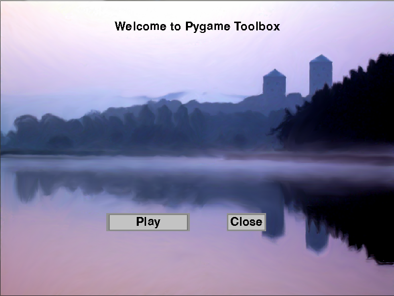

# Pygame Toolbox

(Version 0.1)  
Written for Python 3.X  
Untested in Python 2.X

##Introduction

This is a collection of useful code for anyone wanting to work with game making in Python. Current code deals with menu creation and boardgame like tile usage. For details on using the library please refer to the [examples](/examples) page.

##Install Instructions

There is not currently a clean way to obtain Pygame Toolbox. The best way to get the library is probably to either clone the repo using git or download the zip file and move the extracted folder to some location that is on your PATH/PYTHONPATH.

###Dependencies

This library is dependant on the following

* [Pygame](http://www.pygame.org/download.shtml)

##Contributors

Ideas and contributions are always welcome. Any found bugs or enhancement suggestions should be posted in the issues tab. 

##Aditional Information

###Licensing

This project is distributed using the MIT license  
For more licensing information read [LICENSE](./LICENSE)  

###Contact Info:

This project does not have a mailing list and so the issues tab should be the first point of contact if wishing to discuss the project. If you have questions that you do not feel are relavent to the issues tab or just want to let me know what you think about the library, feel free to email me.
  
Email: <a href="mailto:jmilam343@gmail.com">jbmilam343@gmail.com</a>