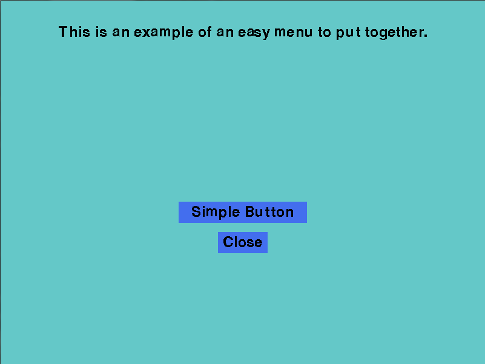

#Menu Tutorial
In this tutorial I'm going to go over the code in the script menu_examples.py where we build 3 different menu objects (simple menu, detailed menu and mini menu) and two different text_screens objects (simple text screens and detailed text screens).
This script can be found [here](./menu_examples.py)

First let us begin by importing the modules that we will need. Since pygame_toolbox.graphics is a bit verbose I'm going to import it as ptg.
    
        # Import the graphics tools and pygame and sys
        import pygame_toolbox.graphics as ptg
        import pygame,sys

Next I'm going to define a function to properly close out of the program when needed. Without this you'll get errors when trying to close the pygame screen.

        def close():
            # close out pygame and the game window properly
            pygame.quit()
            sys.exit()

##Simple menu
Now we're ready to begin coding the simple menu. To start create a simple menu class that inherits from Pygame Toolbox graphic's menu class.

        class Simple_menu(ptg.Menu):

Next we define the size of the menu in number of pixels (for this tutorial the screen size is going to be 800x600 pixels) and the text displayed at the top of the menu as a header variable.

            def __init__(self):
                # Define the size of the screen (x,y) in number of pixels
                size = (800,600)
                # Create a header which will be the text at the top of the menu screen
                header = ["This is an example of an easy menu to put together."]

Next we're going to define what buttons we want to include in the menu. To do this we use embedded lists where the first item in the inner list is the text to be displayed on the button and the second item is the function returned when the button is clicked upon. For now we're going to just include a single button and a button that will close out of the screen using our close function from earlier.

                # Give the text and functions for the buttons that the menu class will create
                buttons = [["Simple Button",lambda:2],["Close",close]]

*Side Note on Functionality*: The clicked on function is also returned by the menu and the menu object exits out when a button is clicked. To get a better idea of what is happening, I'm going to show the update function of the menu.(**NOTE: This is not actual code for the example, but rather some of the code from the graphics file.**)
        
        while True:
            clock.tick(30)
            for event in pygame.event.get():
                if event.type == pygame.QUIT:
                    pygame.quit()
                    sys.exit()
                for i in self.buttonlist:
                    if event.type == pygame.MOUSEBUTTONUP and i.rect.collidepoint(pygame.mouse.get_pos()):
                        if self.music is not None:
                            pygame.mixer.music.stop()
                        return i()

It should also be noted that this is only a part of the update function, not the full function. If you'd rather something not exit the menu when its function is run look to the widgets, however, at the time of this writing widgets have not been developed yet.

Back to the simple menu you should now have the size of the menu, the header text and the buttons defined for the menu. All that is left is to call the inherited menu's __init__ function and pass in our variables (the values could be passed in manually without the use of intermediate variables if desired). The tuple input is for the background variable of the menu. For this menu we're using a tuple that gives a color as a rgb value and the menu will make this color the background color.

                # Run the menu class's init function
                ptg.Menu.__init__(self,size,(200,200,200),header,buttons)
                
Your whole class should now look like this.

        class Simple_menu(ptg.Menu):
            def __init__(self):
                # Define the size of the screen (x,y) in number of pixels
                size = (800,600)
                # Create a header which will be the text at the top of the menu screen
                header = ["This is an example of an easy menu to put together."]
                # Give the text and functions for the buttons that the menu class will create
                buttons = [["Simple Button",lambda:2],["Close",close]]
        
                # Run the menu class's init function
                ptg.Menu.__init__(self,size,(200,200,200),header,buttons)

We aren't ready to display anything yet unfortunately. Lets start our next step by building an event handler in a class called Main. in the initialization method we're going to set a progress attribute to 1 and this will handle switching between screens. Also we're going to create a pygame Clock object and attach it to main in a clock attribute. The code for these steps can be seen below.

        class Main:
            def __init__(self):
                self.progress = 1
                self.clock = pygame.time.Clock()

We now need to code the event handling portion of the class and to do this we're going to use an infinite while loop in an update method. The while loop will check the progress attribute and call the corresponding screen. The return from the screen will then be the next value of the progress attribute to direct to other screens (The return of the button function will determine what the menu returns as discussed above). The update function is given below.

            def update(self,screen):
                # Handle the events using a progress indicator and the update method of
                # the menu and text screen classes
                while True:
                    if self.progress == 1:
                        self.progress = Simple_menu().update(screen,self.clock)
                    elif self.progress == 2:
                        close()
                        
For now I'm leaving progress = 2 (our simple button was pressed) as returning the close function so that we do not create an error when checking to see if the button works. The menu is then called along with its update method to let it have control of the screen. The full main class is given as

        class Main:
            def __init__(self):
                self.progress = 1
                self.clock = pygame.time.Clock()

            def update(self,screen):
                # Handle the events using a progress indicator and the update method of
                # the menu and text screen classes
                while True:
                    if self.progress == 1:
                        self.progress = Simple_menu().update(screen,self.clock)
                    elif self.progress == 2:
                        close()

Last thing we need before we can run the script is something to run the necessary inits and the Main class event handler. I'm going to put this code under a script/module test so that the screen will only appear if the file is being run itself instead of being imported else where. where we are going to want to run the pre_init of pygame's mixer, run pygame's init and create a screen. Now we can create and call the Main class and its update method. This code can be seen below.

        if __name__ == '__main__':
            pygame.mixer.pre_init(44100, -16, 2, 2048)
            pygame.init()
            screen = pygame.display.set_mode((800,600))
            Main().update(screen)

Now we're ready to run the script. If you've done everything so far your pygame window should look like this

