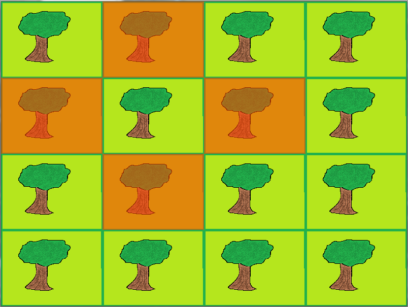

#Tilegame Tutorial
(Note: This tutorial is written for pygame_toolbox version 0.1)

This tutorial will go over the tile and tilelist classes in the tilegame_tools
module and wrap up by using the tilemap class to put the previous sections
together. The [tiletools example](./tiletools_example.py) script is what this
tutorial will be following. (Note these tiles are similar to board game tiles.
If you were looking for code to interact with the tiled editor I would suggest
checking out [PyTMX](https://github.com/bitcraft/PyTMX).)

To begin the tutorial we'll import the tilegame tools from pygame toolbox along
with pygame and sys.

```python
    # Import the tile game toolbox, pygame and sys
    import pygame_toolbox.tilegame_tools as pttt
    import pygame, sys
```

Now we can begin the disscussion on the different classes that are covered in
this tutorial.

##The Tile Class

This is the main class for tilegames. It will hold information for each
individual space on the game board. Lets begin by subclassing the tile class in
our script.

```python
    # Create a custom Tile class
    class Tile(pttt.Tile):
        def __init__(self,file,size):
            # Pass the file and size arguments to the init of the class
            # in the toolbox
            pttt.Tile.__init__(self,file,size)
```

The file input is the string of the picture file that we want to be the image
for the tile. The size argument is the x,y size of the tile in pixels. As is it
seems like subclassing has not provided us with any benefit from the original
class but now we can attach additional attributes to each instance. For example
if we were doing a city building type of board game we could attach resources
to the tile or an attribute to determine which player owns the tile. What we
are going to do in the tutorial, though, is cover the other main aspect of the
tile class, shades. Here we are going to initialize a shade to be put over the
tile under certain conditions. I'm going to go ahead and show the code then
explain each of the inputs.

```python
            # Add a shade to the tiles shade dictionary
            pttt.Tile.initialize_shade(self,"orange red",(255,69,0),150)
```

The "orange red" argument in the method is what we want our shade to be called.
The three item tuple is the rgb value of the shade (a planned addition is to
allow strings with a picture file's name to be used instead of rgb values). The
last item in the method call is the alpha value of the shade. This number
ranges from 0 to 255 and determines the transparency of the shade where 0 is
completely transparent and 255 is completely solid. The initialize shade method
will take these arguments and will add them to the instances shade dictionary
where the key is the name we gave the shade and the value is a pygame surface
with the color and transparency we passed. This shade will be placed over the
image using the toggle_shade method discussed later in this tutorial.

A side effect of the shades feature is that the tile class is now useful in
places other than boardgame like games. It can be taken advantage of any place
there is an image that needs to have a toggleable shade. We're now done with
the tile class and are ready to discuss the tilelist class.

##The Tilelist Class

The tilelist class directly inherits from the builtin list class. This means
that it will have all of the features, methods and functionality of a regular
list. We are going to use the tile list to hold an array of tiles. To achieve
this we are going to use embedded lists where each embedded list is a new row
of tiles. In the tutorial we are going to attach the list to our event handler
class, Main. This code will be shown below but for more information on making
event handlers using pygame_toolbox refer to the [menu
tutorial](../menu_example/menu_tutorial.md).

```python
    class Main:
        def __init__(self):
            # Create a 4x4 matrix of tiles and use the tilelist class to
            # obtain additional functionality for the matrix.
            self.tilelist = pttt.Tilelist([[Tile('forrest.png',(200,150)) for i in range(0,4)],
                                           [Tile('forrest.png',(200,150)) for i in range(0,4)],
                                           [Tile('forrest.png',(200,150)) for i in range(0,4)],
                                           [Tile('forrest.png',(200,150)) for i in range(0,4)]])
            self.clock = pygame.time.Clock()
            self.progress = 1
```

The tilelist attribute will be a 4 by 4 matrix of tile objects using our
subclassed tile class from the previous section. The reason to use a tilelist
instead of a regular list is that it has an extra method called adjacent_tiles.
This method when called with a specific tile will return a list of the tiles
around the input tile using a specific pattern. This method will be discussed
in greater detail when the rest of the script is assembled. We are now ready to
move on to our discussion on tilemaps.

##The Tilemap Class

This class is very similar to the menu class from the graphics module in that
it draws all of the tiles on the screen and handles the events for the tile
list. We are going to begin by subclassing the tilemap from the tilegame_tools
module and reduce the amount of inputs it will require for this script.

```python
    # Create the tilemap object that will handle displaying all of the
    # tiles
    class Tilemap(pttt.Tilemap):
        def __init__(self,tilelist):
            pttt.Tilemap.__init__(self,(800,600),tilelist,1)
```

The init for the parent tilemap class is run and pased a tuple of the x,y size
of the screen in pixels, the tilelist and a 1 for the buttonflag input. The
buttonflag input lets the tilemap know if you want it to return a tile that was
clicked on, 1, or to check for items in a buttonlist like the menu class, 0.
**Note that the tiles created for the tilelist will need to be presized to
match the tilemap as the class does not currenly resize them to make them fit
the tilemap size**. This concludes the discussion on the tilemap class and so
we will now move on to the example to wrap everything together and provide
greater discussion on topics that were mentioned briefly earlier in the
tutorial.

##Tilegame Example Script

So far in the tutorial we have subclassed the tile and tilemap classes and
created an event handler's init method. We still need to define the event
handler's update method and call the event handler itself. 

Lets start with the event handler's update method. What we're going to do is
code it such that the user can click on a tile on the tilemap and we'll find
the adjacent tiles and toggle the orange red shade we initialized in our tile
class. First we're going to need to add the update method and assign the value
returned from the tilemap to a tileclicked variable.

```python
    def update(self,screen):
        while True:
            if self.progress == 1:
                # When a tile is clicked shade the 4 tiles around it
                # using the orange red shade we created
                tileclicked = Tilemap(self.tilelist).update(screen,self.clock)
```

This will work because we passed a 1 to the buttonflag when we initialized the
tilemap earlier. Now that we have access to the tile that the user clicked,
we're going to pass that tile to the tilelist's adjacent tiles method to get a
list of the tiles surrounding the tile that was clicked.

```python
                adjtiles = self.tilelist.adjacent_tiles(tileclicked,'p')
```

Note that in addition to the tileclicked, 'p' was also passed in. This input
lets the tilelist class know what sort of pattern you are looking for adjacent
to the tile clicked. The 'p' stands for plus sign with the other options being
'x' for a diagonal pattern and 'b' for all of the tiles in a box around the
tile that was clicked. We now have the tiles adjacent to the tile that was
clicked and so the last thing to do is to toggle the shade for these tiles. To
do this we are going to use a for loop and run the toggle_shade method for each
tile.

```python
                for i in adjtiles:
                    i.toggle_shade("orange red")
```

The only input for this method is the name of the shade you want to toggle
which is the same name that the shade was assigned upon initialization. Note
that the tile class automatically initializes blue and red shades for use. Now
our event handler is complete and the only thing remaining is to call the event
handler.

This next bit of code will initialize pygame, set up a display screen and call
the event handler.

```python
    if __name__ == '__main__':
        pygame.init()
        screen = pygame.display.set_mode((800,600))
        Main().update(screen)
```

Now the script is ready to run and the main features of the tilegame toolbox
have been introduced. The whole script can be accessed at the top of this page.
When a tile is clicked the screen should look like the following screenshot.


